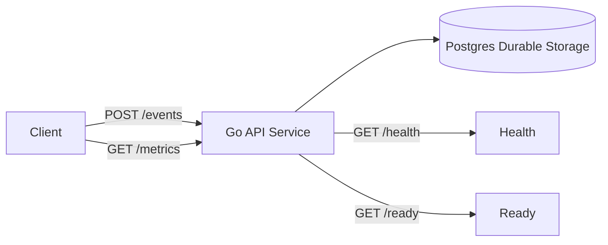

# 🚀 Event Analytics Service

> **Production-style multi-tenant event ingestion system with clear ingestion, processing, and serving boundaries.**  
> Designed to demonstrate correctness, scalability, reliability, and cloud-ready architecture rather than just API functionality.  
> The implementation runs locally with Docker while mapping cleanly to Google Cloud services such as Cloud Run, Pub/Sub, and Cloud SQL.

---

## ✨ What This Service Demonstrates

- Multi-tenant event ingestion
- Idempotent writes (safe retries)
- Durable storage
- Near-real-time metrics queries
- Explicit architecture separation (ingestion / processing / serving)
- Production deployment readiness (GCP mapping)
- End-to-end integration tests

This project is intentionally designed to reflect how real analytics ingestion pipelines are built in production systems.

---

## 🏗 Architecture Overview



---

## 🔹 Logical System Paths

### 📥 Ingestion Path

1. Client sends `POST /events`
2. API authenticates tenant using API key
3. Request payload validated
4. Idempotency enforced using:

```
tenant_id + event_id uniqueness
```

5. Event stored durably in Postgres

---

### ⚙️ Processing Path

**Local implementation**

- Processing happens inline during ingestion.

**Production architecture**

- ingestion publishes event to Pub/Sub  
- worker service consumes event  
- worker persists event  

This enables:

- burst tolerance  
- independent scaling  
- reduced ingestion latency  

---

### 📊 Serving Path

1. Client calls `GET /metrics`
2. Tenant validated
3. Indexed database query executed

```sql
SELECT COUNT(*)
FROM events
WHERE tenant_id = ...
AND event_name = ...
AND timestamp >= from
AND timestamp < to;
```

4. Count returned

---

## 🔐 Authentication

All protected endpoints require:

```
X-API-Key: <tenant-key>
```

Each key maps to one tenant.

---

## 🔁 Idempotency

To safely retry ingestion:

```
Idempotency-Key: <unique-event-id>
```

Duplicate events:

- stored once  
- counted once  

---

## 📡 API Endpoints

---

### ❤️ Health

```
GET /health
```

Returns `200` if process is alive.

---

### 🟢 Ready

```
GET /ready
```

Returns:

- `200` if database reachable  
- `503` otherwise  

---

### 📥 POST /events

Headers:

```
X-API-Key: required
Idempotency-Key: recommended
```

Body:

```json
{
  "event_name": "login",
  "timestamp": "2026-02-13T20:00:00Z",
  "properties": {
    "source": "web"
  }
}
```

Responses:

| Code | Meaning |
|------|--------|
| 201 | event stored |
| 200 | duplicate replay |
| 400 | invalid request |
| 401 | unauthorized |

---

### 📊 GET /metrics

```
GET /metrics?event_name=...&from=...&to=...
```

Example response:

```json
{
  "event_name": "login",
  "count": 42
}
```

### ⏱ Time Window Semantics

```
[from, to)
```

Inclusive start, exclusive end.

---

## 🧰 Running Locally

### Start

```bash
docker compose up --build
```

---

### Verify

```bash
curl http://localhost:8080/health
curl http://localhost:8080/ready
```

---

### Example ingestion

```bash
curl -X POST http://localhost:8080/events \
  -H "X-API-Key: tenant-key-123" \
  -H "Idempotency-Key: example1" \
  -H "Content-Type: application/json" \
  -d '{"event_name":"login","timestamp":"2026-02-13T20:00:00Z"}'
```

---

### Query metrics

```bash
curl "http://localhost:8080/metrics?event_name=login&from=2026-02-13T00:00:00Z&to=2026-02-14T00:00:00Z" \
-H "X-API-Key: tenant-key-123"
```

---

## 🧪 Testing

Integration tests validate:

- health endpoint  
- readiness endpoint  
- authentication behavior  
- ingestion correctness  
- duplicate protection  
- tenant isolation  
- window correctness  

Run:

```bash
go test ./tests -v
```

Or:

```bash
make test
```

---

## 📈 Scaling Strategy

### API Layer

- Stateless service  
- Horizontal scaling supported  

👉 Production: **Cloud Run autoscaling**

---

### Event Processing (Production)

At scale:

- ingestion publishes to Pub/Sub  
- workers consume events  
- workers persist events  

Benefits:

- absorbs bursts  
- reduces ingestion latency  
- enables independent scaling  

---

### Storage Scaling

Current:

```
Postgres + index(tenant_id,event_name,timestamp)
```

Future:

- partition tables  
- shard by tenant  
- migrate to Spanner  
- stream events to BigQuery  

---

## ⚠️ Failure Modes & Reliability

### Duplicate Requests

Cause:

- retries  
- network timeout  
- message redelivery  

Handled via:

```
unique constraint on tenant_id + event_id
```

---

### Database Unavailable

- readiness fails  
- ingestion returns error  
- monitoring alerts triggered  

---

### Queue Backlog (production)

- workers auto-scale  
- backlog monitored  
- dead-letter queue captures failures  

---

## ⚖️ Trade-offs

| Choice | Pros | Cons |
|---|---|---|
| Inline processing | simple, consistent | DB latency affects ingestion |
| Async processing | scalable, burst tolerant | eventual consistency |
| Postgres | simple, transactional | not ideal for massive analytics |

---

## ☁️ Google Cloud Deployment Mapping

| Local Component | GCP Equivalent |
|---|---|
| API container | Cloud Run |
| Postgres | Cloud SQL |
| Secrets | Secret Manager |
| Queue | Pub/Sub |
| Worker | Cloud Run |
| Logs | Cloud Logging |
| Metrics | Cloud Monitoring |

---

## 📘 OpenAPI

Schema available in:

```
openapi.yaml
```

---

## 🚀 Future Improvements

- async ingestion worker mode  
- per-tenant rate limiting  
- distributed tracing  
- caching heavy queries  
- streaming export to BigQuery  
